<div align="center">

# 🛍️ Trendora

### Premium Fashion E-Commerce Web Application

*A full-stack fashion e-commerce platform built using Java, JSP, Servlets, JDBC, MySQL, and Apache Tomcat, following the MVC architecture.*


</div>

---

## 📖 About the Project

**Trendora** is a full-stack fashion e-commerce web application that provides a seamless online shopping experience. It is developed using **Java Web Technologies** with the **Model-View-Controller (MVC)** architecture to ensure clean code organization, maintainability, and scalability.

The application allows customers to browse products, explore categories, view product details, manage shopping carts, register and log in securely, and place orders through an intuitive interface. The backend is powered by **Java Servlets**, **JSP**, **JDBC**, and **MySQL**, while **Apache Tomcat** serves as the web server.

This project was built to strengthen my understanding of Java Full Stack Development by implementing real-world e-commerce functionalities, database connectivity, session management, and secure web application development without relying on heavyweight frameworks.

---

## ✨ Key Highlights

* 🛍️ Complete Fashion E-Commerce Platform
* 👤 User Registration & Secure Login
* 🛒 Shopping Cart Management
* 🔍 Product Search & Category Filtering
* 📦 Order Placement & Checkout
* 🗄️ MySQL Database Integration
* 🔐 Session-Based Authentication
* 🏗️ MVC Architecture
* ⚡ Built using Core Java Web Technologies

---

## 📑 Table of Contents

* About the Project
* Features
* Technology Stack
* Screenshots
* Project Architecture
* Project Structure
* Database Design
* Installation Guide
* Build from Scratch
* Project Workflow
* Security Features
* Challenges Faced
* Future Enhancements
* Interview Explanation
* Resume Description
* Contributing
* License

---

# ✨ Features

Trendora offers a complete online shopping experience with essential e-commerce functionalities for customers.

### 👤 User Management
- User Registration
- Secure Login & Logout
- Session-Based Authentication
- User Profile Management

### 🛍️ Product Management
- Browse Fashion Products
- View Product Details
- Browse by Categories
- Product Search Functionality
- Multiple Product Sizes

### 🛒 Shopping Experience
- Add Products to Cart
- Update Product Quantity
- Remove Products from Cart
- Responsive Shopping Interface

### 📦 Order Management
- Secure Checkout Process
- Place Orders
- View Order History
- Order Summary

### 💾 Database
- MySQL Relational Database
- 8 Well-Normalized Tables
- JDBC Connectivity
- Efficient SQL Queries using PreparedStatement

---

# 🛠️ Technology Stack

| Layer | Technologies |
|--------|-------------|
| Programming Language | Java (JDK 23) |
| Backend | Java Servlets, JSP |
| Database Connectivity | JDBC |
| Database | MySQL |
| Frontend | HTML5, CSS3, JavaScript |
| Architecture | MVC (Model-View-Controller) |
| Build Tool | Maven |
| Server | Apache Tomcat |
| Version Control | Git & GitHub |
| IDE | Eclipse IDE |

---

# 📸 Screenshots

> **Add screenshots of the following pages after completing the project documentation.**

### 🏠 Home Page


---

### 🔐 Login Page

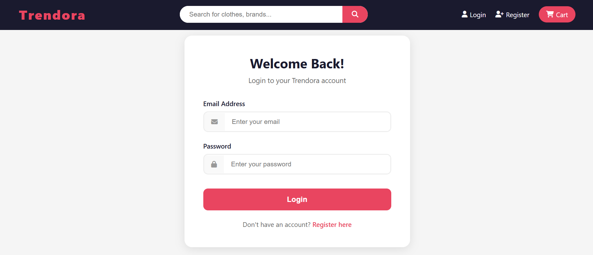

---

### 📝 Registration Page

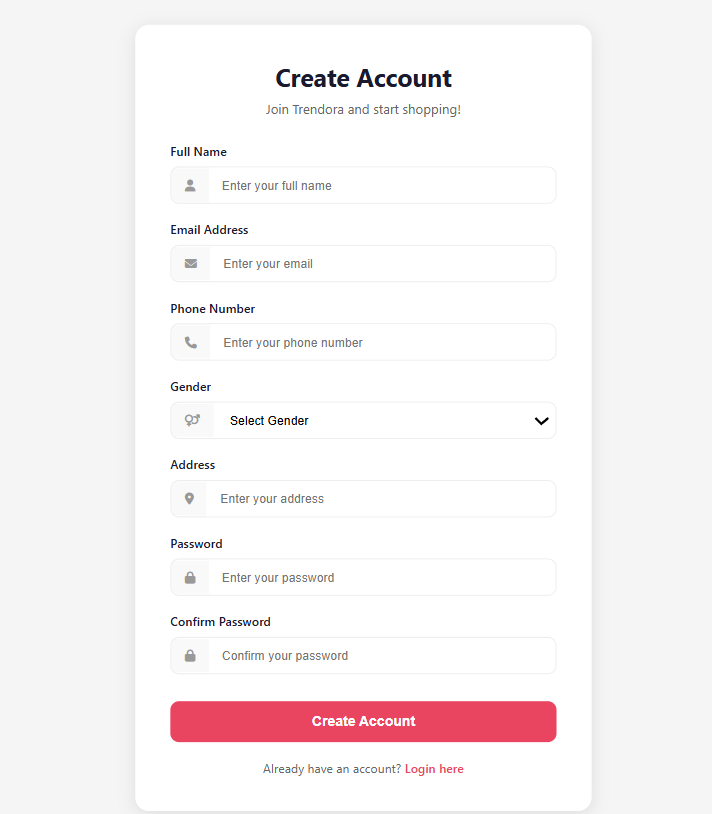

---

### 🛍️ Product Listing

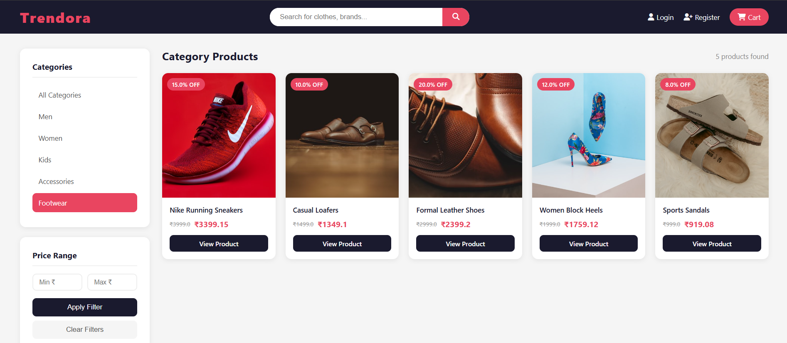

---

### 📄 Product Details

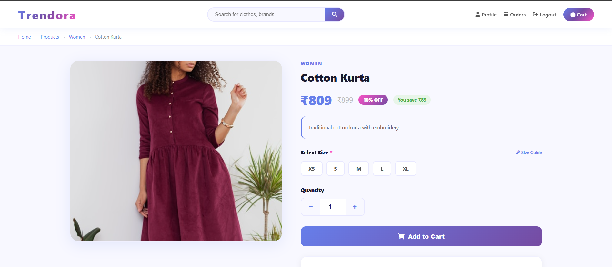

---

### 🛒 Shopping Cart

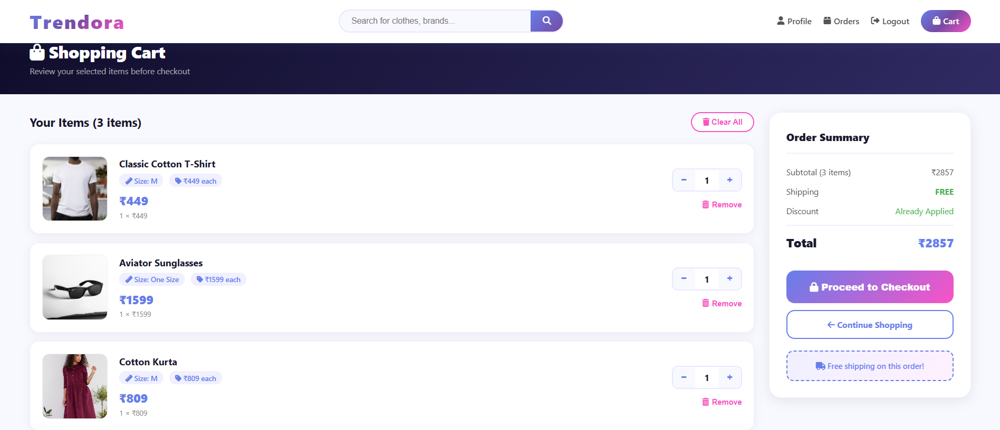

---

### 💳 Checkout

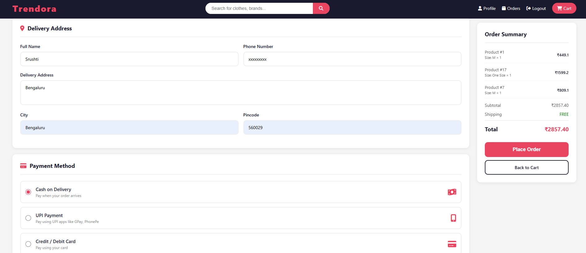

---

### 📦 Order History

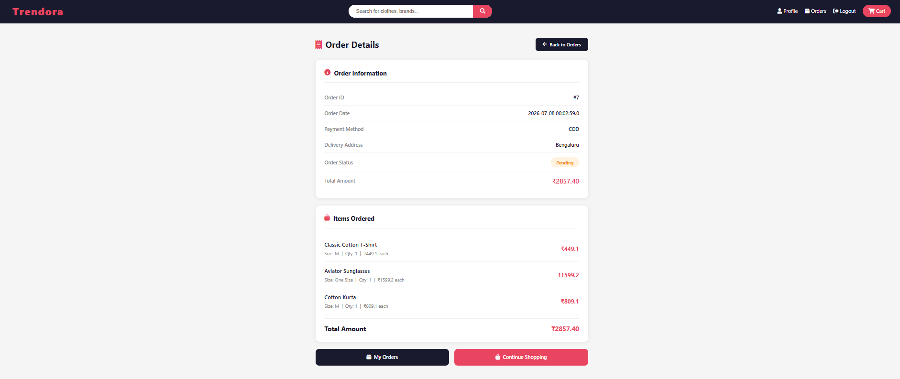

---

# 🏗️ Project Architecture

Trendora follows the **Model-View-Controller (MVC)** architecture to separate business logic, presentation, and data access. This structure improves maintainability, scalability, and code organization.

```text
                Client (Browser)
                       │
                HTTP Request
                       │
                Java Servlets
                 (Controller)
                       │
         ┌─────────────┴─────────────┐
         │                           │
     Business Logic             Database Access
      (DAO Layer)              (JDBC + MySQL)
         │                           │
         └─────────────┬─────────────┘
                       │
                    MySQL
                       │
                  Query Result
                       │
                    JSP Views
                       │
                 HTML Response
                       │
                    Browser
```

### MVC Components

| Layer | Responsibility |
|--------|----------------|
| **Model** | Represents application data such as Users, Products, Orders, Cart, and Categories. |
| **View** | JSP pages responsible for rendering the user interface. |
| **Controller** | Java Servlets handle HTTP requests, process user input, and communicate with the DAO layer. |
| **DAO** | Performs CRUD operations using JDBC and interacts directly with the MySQL database. |

---

# 📂 Project Structure

```text
Trendora
│
├── src
│   ├── main
│   │   ├── java
│   │   │   ├── com.trendora.controller
│   │   │   ├── com.trendora.dao
│   │   │   ├── com.trendora.dao.impl
│   │   │   ├── com.trendora.model
│   │   │   └── com.trendora.util
│   │   │
│   │   ├── resources
│   │   │
│   │   └── webapp
│   │       ├── css
│   │       ├── images
│   │       ├── js
│   │       ├── META-INF
│   │       ├── views
│   │       └── WEB-INF
│   │
│   └── test
│
├── target
├── pom.xml
└── README.md
```

---

# 📦 Package Description

### 📁 com.trendora.controller
Contains Java Servlets responsible for handling client requests, processing user actions, and forwarding responses to JSP pages.

### 📁 com.trendora.dao
Defines Data Access Object (DAO) interfaces for database operations.

### 📁 com.trendora.dao.impl
Provides JDBC implementations of DAO interfaces using SQL queries and `PreparedStatement`.

### 📁 com.trendora.model
Contains Java model (POJO) classes representing entities such as Users, Products, Orders, Categories, and Cart.

### 📁 com.trendora.util
Includes utility classes such as database connection management and common helper methods.

### 📁 webapp/views
Contains JSP pages used to render the user interface.

### 📁 webapp/css
Stores all stylesheet files.

### 📁 webapp/js
Contains JavaScript files for client-side interactions.

### 📁 webapp/images
Stores application images, banners, logos, and product assets.

### 📁 WEB-INF
Contains protected configuration files and resources that are not directly accessible from the browser.

---


# 🗄️ Database Design

Trendora uses **MySQL** as its relational database management system. The database is designed using normalization principles to reduce redundancy and maintain data integrity. Relationships between entities are established using **Primary Keys** and **Foreign Keys**.

---

## 📊 Database Schema

| Table Name | Description |
|------------|-------------|
| **users** | Stores customer registration and login information. |
| **categories** | Stores different product categories. |
| **products** | Contains product information. |
| **product_sizes** | Stores available sizes and stock information for each product. |
| **cart** | Stores shopping cart details for each user. |
| **cart_items** | Stores products added to a user's shopping cart. |
| **orders** | Stores order information after checkout. |
| **order_items** | Stores products associated with each order. |

---

## 📊 Entity Relationship Diagram

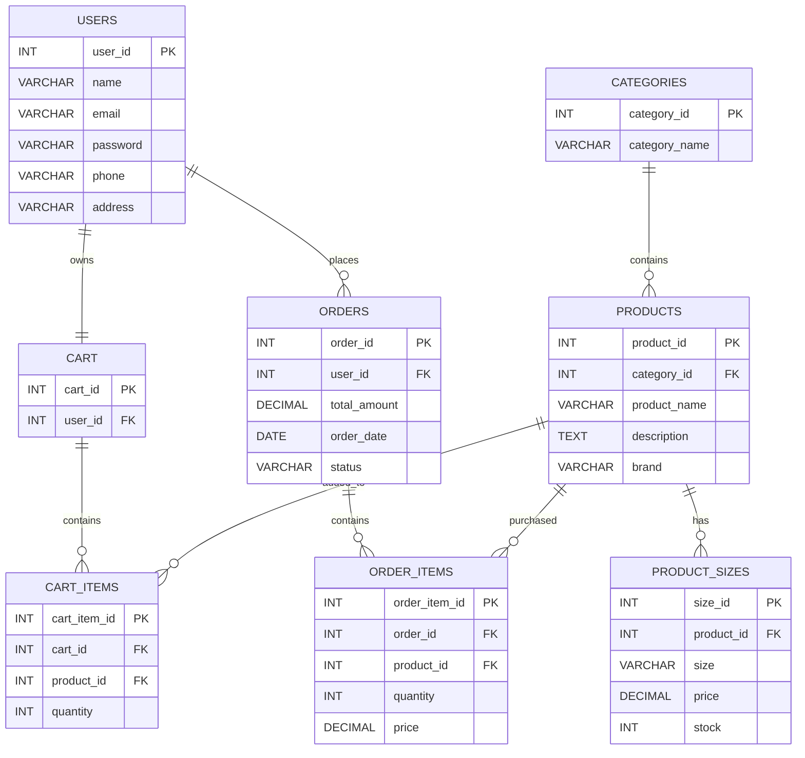

---

# 🔄 Request Flow

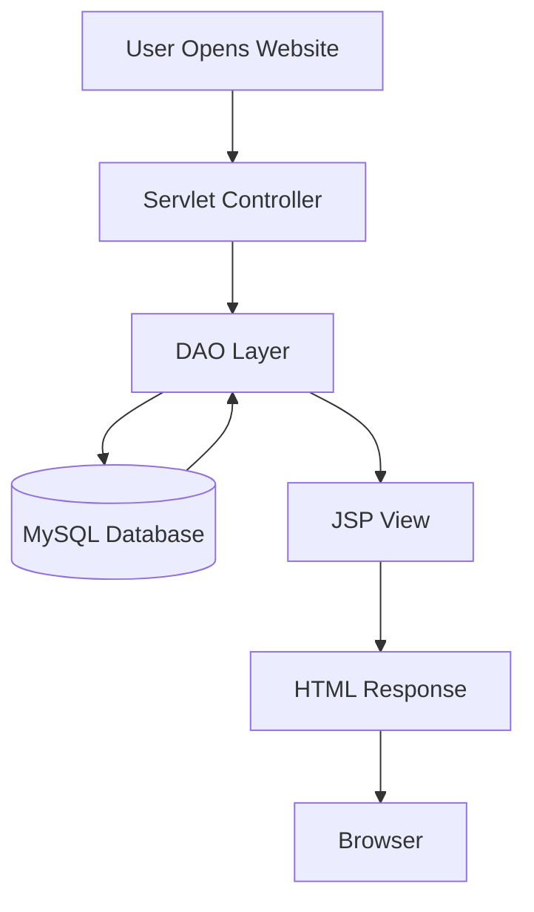

---

# 🏗️ MVC Architecture

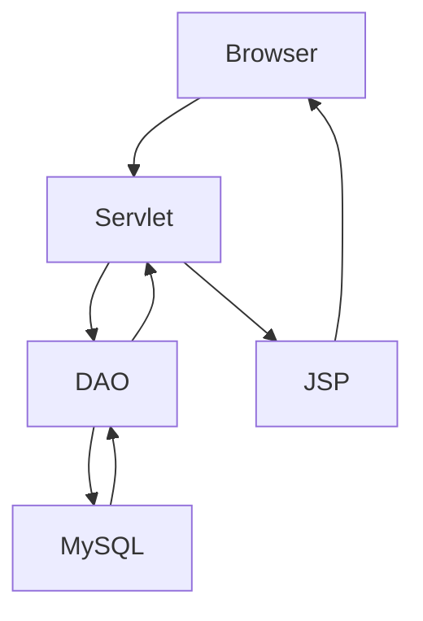


# 📋 Table Details

## 👤 users

Stores customer information.

| Column | Description |
|---------|-------------|
| user_id | Primary Key |
| name | Customer Name |
| email | Unique Email |
| password | Encrypted Password |
| phone | Mobile Number |
| address | Customer Address |

---

## 🛍️ categories

Stores product categories.

| Column | Description |
|---------|-------------|
| category_id | Primary Key |
| category_name | Category Name |

---

## 👕 products

Stores product information.

| Column | Description |
|---------|-------------|
| product_id | Primary Key |
| category_id | Foreign Key |
| product_name | Product Name |
| description | Product Description |
| brand | Brand Name |

---

## 📏 product_sizes

Stores available sizes and inventory.

| Column | Description |
|---------|-------------|
| size_id | Primary Key |
| product_id | Foreign Key |
| size | Product Size |
| price | Product Price |
| stock | Available Stock |

---

## 🛒 cart

Stores each user's shopping cart.

| Column | Description |
|---------|-------------|
| cart_id | Primary Key |
| user_id | Foreign Key |

---

## 🛍️ cart_items

Stores products inside the shopping cart.

| Column | Description |
|---------|-------------|
| cart_item_id | Primary Key |
| cart_id | Foreign Key |
| product_id | Foreign Key |
| quantity | Selected Quantity |

---

## 📦 orders

Stores order details.

| Column | Description |
|---------|-------------|
| order_id | Primary Key |
| user_id | Foreign Key |
| total_amount | Total Order Price |
| order_date | Order Date |
| order_status | Order Status |

---

## 📄 order_items

Stores products purchased in an order.

| Column | Description |
|---------|-------------|
| order_item_id | Primary Key |
| order_id | Foreign Key |
| product_id | Foreign Key |
| quantity | Purchased Quantity |
| price | Product Price |

---

# 🔗 Database Relationships

- One user can have one shopping cart.
- One user can place multiple orders.
- One category can contain multiple products.
- One product can have multiple size variants.
- One cart can contain multiple cart items.
- One order can contain multiple ordered products.

---

# 💡 Database Design Highlights

- Designed using relational database principles.
- Implemented Primary Key and Foreign Key constraints.
- Normalized tables to eliminate redundant data.
- Used JDBC PreparedStatement for secure database operations.
- Maintained referential integrity between related tables.
- Optimized product lookup using category-based organization.


---

# 🔄 Project Workflow

This section explains how Trendora processes user requests from browsing products to placing an order.

---

## 🏠 1. User Visits the Website

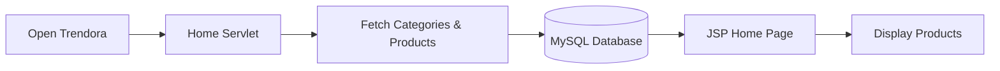

### Workflow

1. The user opens the Trendora website.
2. The request reaches the Home Servlet.
3. The servlet retrieves product and category data from MySQL using JDBC.
4. The data is forwarded to the JSP page.
5. The homepage displays the latest products and categories.

---

## 👤 2. User Registration

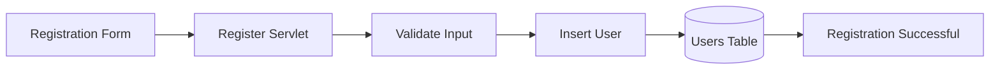

### Workflow

- User enters registration details.
- Input is validated.
- User information is stored securely in the **users** table.
- Registration completes successfully.

---

## 🔐 3. User Login

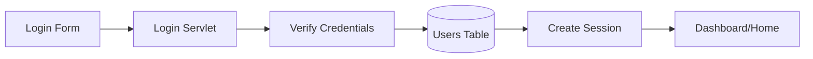

### Workflow

- User enters email and password.
- Credentials are verified.
- A session is created.
- User is redirected to the homepage.

---

## 🛍️ 4. Browse Products

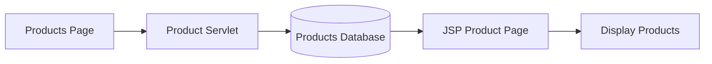

### Workflow

- User visits the products page.
- Product data is fetched using JDBC.
- JSP renders all available products.

---

## 🔍 5. Search Products

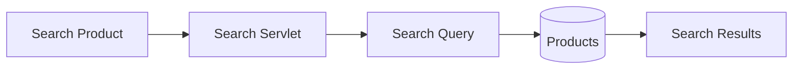

### Workflow

- User searches by product name.
- Servlet executes SQL search query.
- Matching products are displayed.

---

## 🛒 6. Shopping Cart

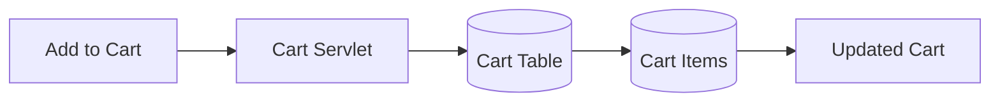

### Workflow

- User clicks **Add to Cart**.
- Product is stored in the user's cart.
- Quantity can be updated or removed.
- Cart total is calculated dynamically.

---


## 💳 7. Checkout

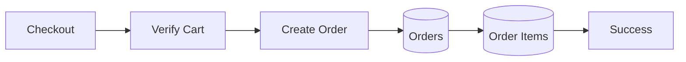

### Workflow

- User reviews cart.
- Order details are stored.
- Cart items become order items.
- Order is successfully placed.

---

## 📦 8. Order History

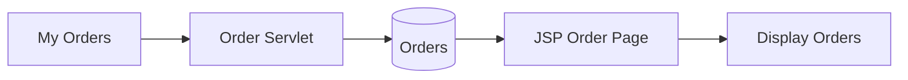

### Workflow

- User opens **My Orders**.
- Previous orders are retrieved.
- JSP displays complete order history.

---

# 📌 Complete Workflow Summary

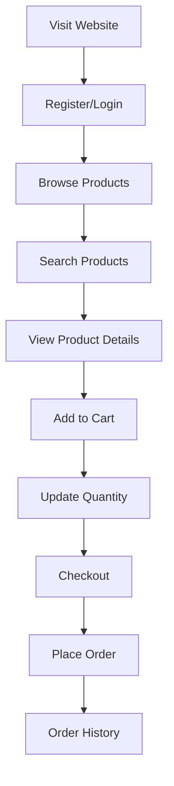

---

# 💡 Key Design Decisions

- MVC architecture separates presentation, business logic, and data access.
- JDBC with PreparedStatement is used for secure database communication.
- JSP is responsible for rendering dynamic web pages.
- Sessions are used to maintain authenticated user state.
- MySQL stores all application data with normalized relational tables.
- Maven manages project dependencies and build configuration.

---

# ⚙️ Installation Guide

Follow these steps to set up and run **Trendora** on your local machine.

## 📋 Prerequisites

Make sure you have the following software installed:

| Software | Version |
|----------|---------|
| Java JDK | 21 or above |
| Eclipse IDE | Latest |
| Apache Maven | 3.9+ |
| Apache Tomcat | 10.1.x |
| MySQL Server | 8.0+ |
| Git | Latest |

---

# 📥 Clone the Repository

```bash
git clone https://github.com/srushti-1123/Trendora.git
```

Move into the project directory.

```bash
cd Trendora
```

---

# 🗄️ Database Setup

## Step 1

Open MySQL Workbench.

---

## Step 2

Create a database.

```sql
CREATE DATABASE trendora;
```

---

## Step 3

Import the SQL file.

```
trendora.sql
```

This will create all required tables:

- users
- categories
- products
- product_sizes
- cart
- cart_items
- orders
- order_items

---

# 🔧 Configure Database Connection

Open the database configuration file.

Example:

```
src/main/java/com/trendora/util/DBConnection.java
```

Update your credentials.

```java
private static final String URL =
"jdbc:mysql://localhost:3306/trendora";

private static final String USERNAME = "root";

private static final String PASSWORD = "your_password";
```

---

# 📦 Import the Project

1. Open Eclipse IDE.

2. File → Import

3. Existing Maven Project

4. Select the Trendora folder

5. Click Finish

6. Maven downloads all dependencies automatically.

---

# 🛠 Configure Apache Tomcat

1. Open the Servers view in Eclipse.

2. Add Apache Tomcat 10.1.

3. Right-click Tomcat.

4. Add Trendora project.

5. Start the server.

---

# ▶️ Run the Application

Open your browser.

```
http://localhost:8080/Trendora
```

If Tomcat uses another port (for example, 8081), update the URL accordingly.

---

# 📂 Build from Scratch

If you want to build the project manually:

### Clean Project

```bash
mvn clean
```

### Compile

```bash
mvn compile
```

### Package

```bash
mvn package
```

Maven generates the WAR file inside:

```
target/
```

Deploy the generated WAR file to Apache Tomcat.

---

# 📁 Project Requirements

- Java JDK
- Maven
- Apache Tomcat
- MySQL
- Eclipse IDE

---

# 🛠 Troubleshooting

### Database Connection Error

✔ Verify MySQL is running.

✔ Check username and password.

✔ Confirm the database name is `trendora`.

---

### Port Already in Use

Change the Tomcat port from:

```
8080
```

to

```
8081
```

or another available port.

---

### Maven Dependencies Not Downloading

Run:

```bash
mvn clean install
```

or

Right-click Project → **Maven → Update Project**

---

### 404 Error

- Verify Tomcat is running.
- Ensure the project is deployed to the server.
- Clean and republish the project.

---

# ✅ Successful Setup

If everything is configured correctly, you should be able to:

- Register a new account
- Login securely
- Browse products
- Search products
- View product details
- Add items to the cart
- Update cart quantity
- Remove items from the cart
- Place orders
- View order history

---

# 🔐 Security Features

Trendora follows secure coding practices to protect user data and ensure safe database interactions.

## Authentication
- Session-based user authentication
- Secure login and logout functionality
- Protected user-specific pages

## Database Security
- JDBC `PreparedStatement` used for all SQL queries
- Prevents SQL Injection attacks
- Proper database connection handling

## Session Management
- User sessions are maintained after login
- Unauthorized users cannot access protected pages
- Sessions are invalidated during logout

## Input Validation
- User inputs are validated before processing
- Required fields are checked before database operations

---

# 🚧 Challenges Faced

During the development of Trendora, several challenges were encountered and resolved.

### 1. Managing User Sessions
**Challenge:** Maintaining user authentication across multiple pages.

**Solution:** Implemented HTTP Session Management using Java Servlets.

---

### 2. Shopping Cart Synchronization
**Challenge:** Keeping the shopping cart updated when users modified quantities or removed products.

**Solution:** Designed separate `cart` and `cart_items` tables and updated records dynamically using JDBC.

---

### 3. Database Connectivity
**Challenge:** Establishing reliable communication between Java and MySQL.

**Solution:** Created a reusable database utility class to manage JDBC connections.

---

### 4. MVC Architecture
**Challenge:** Organizing project files efficiently.

**Solution:** Followed the MVC architecture by separating Controllers, Models, Views, and DAO classes.

---

# 🔮 Future Enhancements

The following features can be added in future versions:

- 💳 Online Payment Gateway Integration
- 📧 Email Notifications
- ⭐ Product Ratings & Reviews
- ❤️ Enhanced Wishlist Management
- 🔔 Order Tracking
- 📱 Progressive Web App (PWA)
- 🌐 REST API using Spring Boot
- 📊 Admin Dashboard & Analytics
- ☁️ Cloud Deployment
- 🧾 Invoice Generation (PDF)

---

# 📚 Learning Outcomes

This project helped me strengthen my understanding of:

- Java Web Development
- Servlets & JSP
- JDBC
- MySQL Database Design
- MVC Architecture
- Session Management
- CRUD Operations
- Git & GitHub
- Maven Project Structure
- Apache Tomcat Deployment

---

# 💼 Resume Description

### Trendora | Java Full Stack Project

Developed a full-stack fashion e-commerce web application using Java, JSP, Servlets, JDBC, MySQL, Maven, and Apache Tomcat following the MVC architecture. Implemented secure user authentication, product browsing, shopping cart, checkout, and order management with efficient database design and responsive user interfaces.

---

# 🎤 Interview Explanation

### Project Summary (2-Minute Version)

Trendora is a Java-based fashion e-commerce web application developed using Servlets, JSP, JDBC, MySQL, and Apache Tomcat. The application follows the MVC architecture, providing clean separation between presentation, business logic, and database operations. Users can register, log in, browse products, search by category, manage shopping carts and place orders, and view order history. The project helped me gain practical experience in Java web development, database design, session management, and MVC architecture.

---

# 🤝 Contributing

Contributions are welcome!

If you would like to improve Trendora:

1. Fork the repository.
2. Create a new feature branch.
3. Commit your changes.
4. Push to your branch.
5. Open a Pull Request.

---

# 📄 License

This project is licensed under the **MIT License**.

Feel free to use, modify, and distribute this project for learning purposes.

---

# 👨‍💻 Author

**Srushti Patil**

Java Full Stack Developer

If you found this project helpful, consider giving it a ⭐ on GitHub!